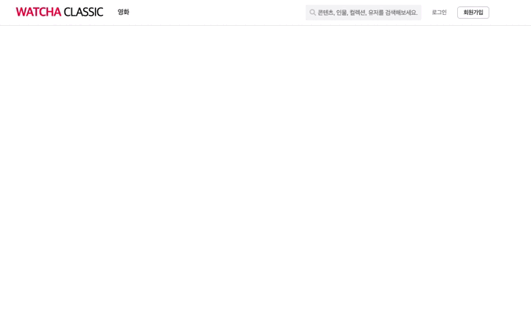

# 로그인, 회원가입 모달창 Open 과정

🤔 위코드 1차 팀 프로젝트인 왓챠피디아 클론코딩 팀프로젝트를 진행하면서 상단 Navigation-bar와 로그인 / 회원가입 창을 맡게 됐다.



> 로그인, 회원가입 버튼을 클릭시 모달창이 open 되며 동시에 `opacity`효과를 준 `div` 를 만들어 `background`를 어둡게 만들어 로그인, 회원가입 창을 강조했다.

### Before : 단순히 3가지 상태를 3개의 useState를 사용 하려고 한 단순한 생각!

```javascript
;[loginModalOn, setLoginModalOn] =
  useState(false)[(signInModalOn, setSignInModalOn)] =
  useState(false)[(modalBackgroundOn, setModalBackgroundOn)] =
    useState(false)
```

- 버튼을 클릭시 각각의 상태를 `true` 로 바꿔 그에 맞는 `모달창`을 오픈 하려고 했다.

### After : 하나의 state에서 관리를 하자!

> 코드의 미니멀리즘은 훨씬 더 나은 가독성과 유지보수 하기에도 편리하다.

```jsx
const [modalStatus, setModalStatus] = useState("")

const handleModal = status => {
  setModalStatus(status)
}
```

`handleModal` 이란 함수는 `status` 라는 인자를 받고 `modalStatus` 의 상태를 "login", "signIn", "" 총 3가지 상태로 바꿔 줄 수 있었고 그에 맞는 로그인 모달창과 회원가입 모달창, opacity 효과가 들어간 `background` 창을 관리 할 수 있었다.

- opacity효과가 들어간 background

```jsx
<div
  className={modalStatus ? "modalBackground" : null}
  onClick={() => handleModal("")}
/>
```

`onClick` 함수를 사용해 클릭시 빈값(`falsy`한 값)을 인자로 받은 `handleModal` 함수는 opacity효과가 들어간 `className` 을 삼항 조건 연산자로 `modalStatus` 가 빈값일 경우 없애 줄 수 있었다.
